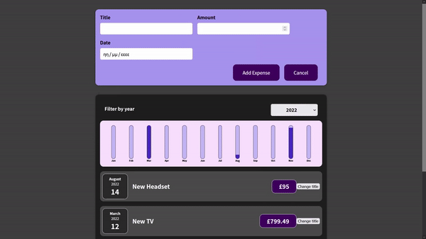

<div align="right">
  
  </a>
</div>

# React-Expenses-Tracking-App
This is a hands-on project from the Udemy course - Beginner React. Create a Expenses Tracking App App by Maximilian Schwarzmüller.

# Demo

<div align="center">
  
</div>

You can run the demo on your local machine, please follow the instructions in [Getting Started](#getting-started).

# Technologies

- [React](https://reactjs.org/)
- [Create React App](https://create-react-app.dev/docs/getting-started/)

Check [`package.json`](./package.json) file for more information.

# Getting Started

Follow the instructions below to set up the environment and run this project on your local machine.

1. Clone this repository.

```bash
# Clone repository
$ git clone https://github.com/ViniUK00/React-Expenses-Tracking-App.git
```

2. Install dependencies via NPM or Yarn

```bash
# Install dependencies via npm
$ npm install
# Install dependencies via yarn
$ yarn install
```

3. Run the server.

```bash
# Build with webpack
$ npm run build
# Run server
$ npm run server
```
